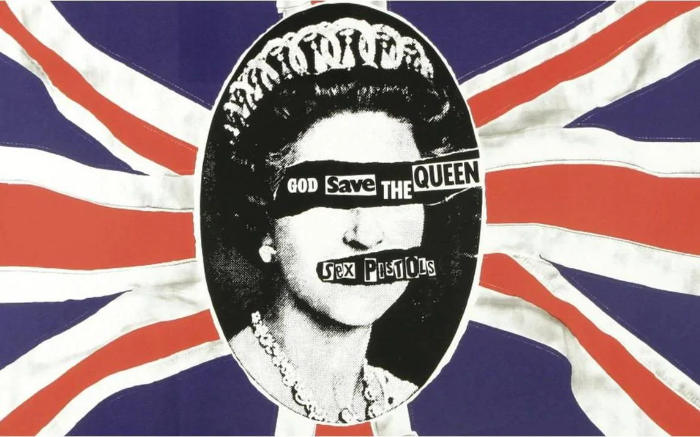

The Punk movement, which exploded in the mid-70s, tore up the rule book, discarding minimalism and neutral sans serif typography. As traditional views were seen as being outdated, punks rebelled against the establishment, combating the political and social turbulence at the time. It brought a new age of music and fashion as well as triggering the post-modern art movement. 

Speaking as the mouthpiece of a generation, the Sex Pistols took to the stage to demand change in society. Their message, along with their outrageous behaviour and scandalous fashion, set the tone for the punk movement. Rather than the extensive process of working alongside a traditional typesetter, the band hired art student Jamie Reid to bring their vision to life. Collaging together letters from newspaper headlines and magazines, Reid formed the mismatched, homemade font which came to define the era.

Inspired by the emergence of Punk music, Reid incorporated subversive, anti-capitalist slogans and deliberately offensive juxtaposed images, into his works. The unrestrained, DIY style lettering was plastered across t shirts, zines, posters and most notably was used as album covers for the Sex Pistols, allowing the anti-establishment movement to flourish. Choosing bold, high impact font, the text sprawled across the Sex Pistol's album covers demands to be heard, much like the shouted vocals which dominate punk music, setting it aside from other genres of music.

In 1977, during the height of the punk music scene, Reid produced a cover to accompany the Sex Pistol's single, ‘God Save the Queen’. The year was also marked to celebrate the Queen’s silver jubilee, adding further controversy and amplifying his anti-societal message.

In the piece, the Queen’s features are torn away to reveal ‘God Save the Queen’ and the band’s name (‘Sex Pistols’) layered together in a mismatched typeface. The lettering is derived from a variation of newspaper headline cuttings, closely resembling a ransom note. The covering of the Queen’s eyes is reflective of her failure to observe and act to change the desolate state of society at the time. The ripping notion is also symbolic of the wildness and rage which fuelled the punk uprising.

The juxtaposition of the black and white Queen with the vividly saturated Union Jack flag produces a significant visual contrast. Rather than focusing on the subject, who would ordinarily dominate the portrait, the eye is drawn to the colours behind making the Queen’s inclusion less significant. 

The Sex Pistol’s ransom note style typography continues to be emulated now, capturing the rule breaking spirit which the Punk movement embodied. Although like all movements Punk fizzled out, evolving into new trends, its impact on fashion, music and typography is still present in society today.