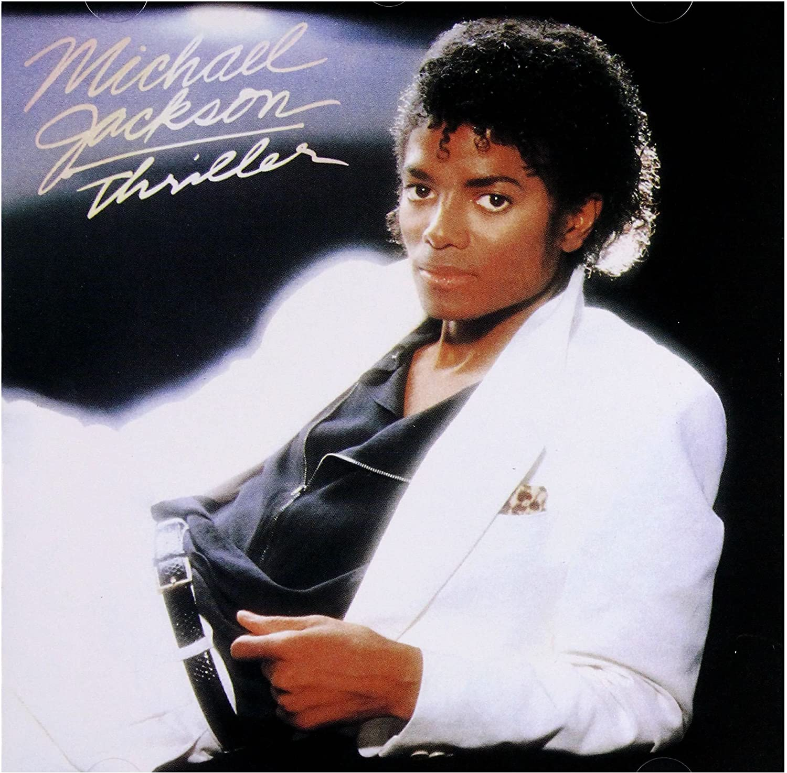

MTV was introduced as a 24/7 music video channel in 1981, a time when the visualization of music was still an emerging concept. The channel’s bold logo and the spotlighting of artists saw a shift in music production, providing a fresh, youthful perspective and catalysing the dominance of the music video in pop culture.

The 3D 'M' comprises most of the MTV logo. Helvetica, the font used, is heavily weighted to give an impact. A high width has been used to show its stability whilst maintaining a modern feel, vital during the launch of it as it was a new idea. 

The size of the 'M' in comparison to the 'TV' demonstrates the emphasis and importance of music to the channel. This was such a vital feature at the brand's launch as broadcasting music was a revolutionary concept, it was the first television channel dedicated to music.

To complete the logo, 'TV' is scrawled across the 'M' in a fast paced graffiti style font. This link to street art is no coincidence; youth culture is at the core of their branding. The spray painted appearance of the font has tones of rebellion and freedom, targeting MTV's youthful audience. The content was a step away from traditional television, leading the youth to a contemporary 'new wave' of broadcasting and social change.  

Rather than selecting corporate colours, as other brands would, a variety of patterns and tones are used to fill the logo. The chameleon like branding still remains in use today, despite not maintaining set branding colours, MTV is still recognisable demonstrating its strength as a brand. 

MTV featured music artists for the first time encouraging more of a focus on their appearance rather than just their music. This encouraged a new wave of album covers spotlighting portraits of singers rather than just the album title. 

Scripted or handwritten font was increasingly used on albums in the 80s, giving music a more personal feel than before. It allowed listeners to connect more with artists. Frequently a lightly weighted, cursive font was used, meaning it was harder to read from a distance. This implies that the viewer was expected to recognise the artist from their photograph on the album. This is demonstrated on the album cover of 'Thriller' by Michael Jackson, a luminious portrait of Jackson occupies the majority of the album cover, inviting in the listener.