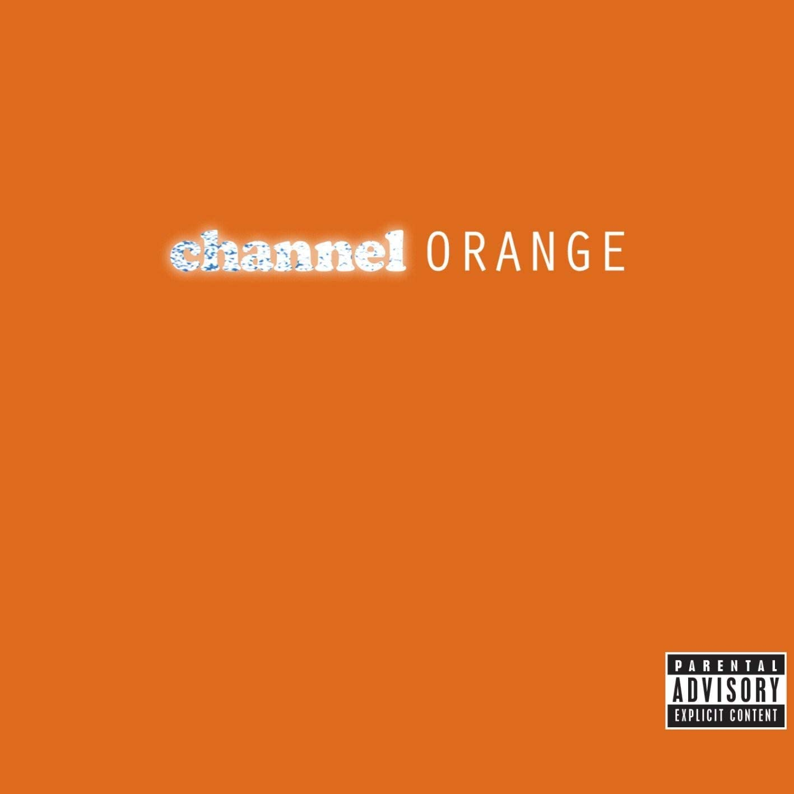

 'Perfection is achieved, not when there is nothing more to add, but when there is nothing left to take away'- Antoine de Saint-Exupery 

Album covers are designed to entice the viewer, ordinarily utilising bold colour schemes and pertinent artwork or by spotlighting the music artist, however some have taken a leap away from the ordinary. Stripping back the paint, those daring enough have allowed their music to speak for itself, relying purely on block colours and spartan typefaces to sell their records.

Leaving more space on an album cover causes a ‘curiosity gap’, encouraging the viewer to use their imagination form their own story. Less clutter cuts away from the unnecessary, narrowing the viewer's focus and emphasizing the bare essentials of the album cover. When done successfully, this strengthens the artist's message. 

In 1968, just a year after the release of the densely adorned 'Sgt. Pepper's Lonely Hearts Club Band', the Beatles released a self-titled album with an almost blank cover. Commonly referred to as 'The White Album' due 

A later example of the minimalist album cover is Frank Ocean's *Chanel Orange,* designed by Thomas Mastorakos.

Although Ocean's cover encapsulates a similar level of simplicity to the white album, the bright orange (#ff6700) used for the background and more chunky fonts make its appearance more playful. 'Channel' has been super imposed in the lower-case cooper black font which lays its roots in the classic hip hop and r&b movement, perhaps here Ocean is paying tribute to those who came before him. Flashes from flashbulbs fill the text, giving an impression of the high life which Ocean lives and the associations with the word 'Channel'. This sits next to a more clean, modern sans-serif 'orange' uppercase in the orator font. The contrast between the two fonts forms a union between the old and new, Ocean is looking back to the past whilst still being relevant and being aware of his surroundings. The use of white in the text forms a divergence away from the orange, allowing the font to appear distinct. 

The zesty orange colour used as the backdrop reflects the grapheme-colour synesthesia which Ocean experienced over the summer he made his album. In the neurological phenomenon synestheia, an individual percieves words and numbers as colours.  As he fell in love, orange was the colour he associated with his emotions. The vibrance also emphasizes the tropical, summer feeling of the album.