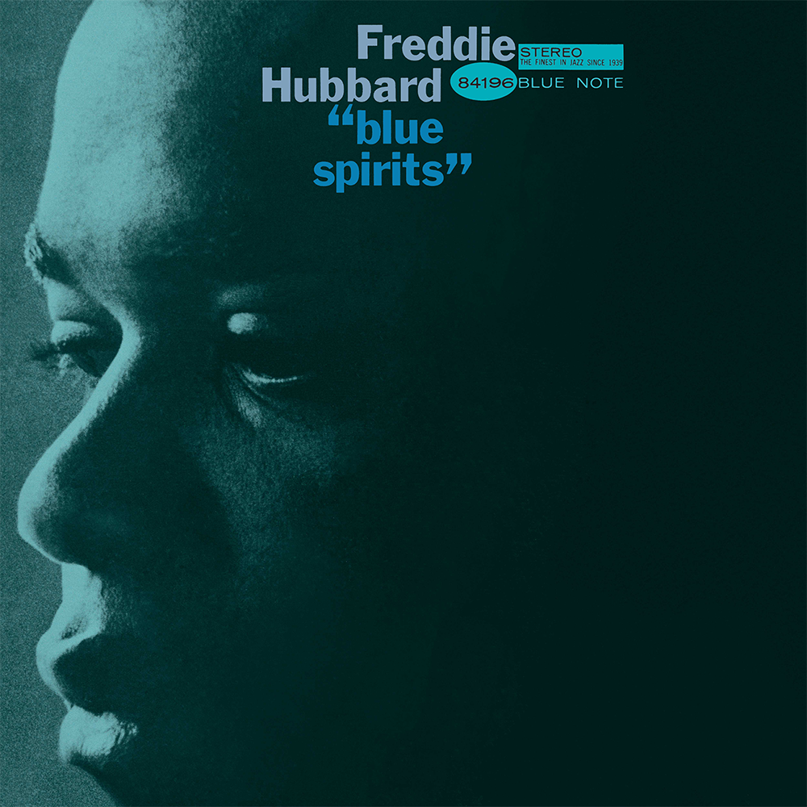

1950s graphic designer Reid Miles produced more than 500 covers for jazz label Blue Note Records. Miles' pioneering style emphasized the importance of typography to the album cover as a whole, allowing the text to take centre stage. Miles' album covers embodied modernism, portraying a single thought or idea in a powerful and simple way. The design carries the message, rather than attempting to be the message.

His distinct preference for contrast and asymmetry reflects the distinction between the black and white keys of a piano - an essential instrument in the Jazz music which Miles promoted. 

Rather than using typography for its primary purpose, to accompany an image, Miles formed it into a visual element which can be layered, stacked playfully or enlarged or shrunk. The typography marries together with the photography in a way that seems gravitational. The layouts are often evasively perfect as they look as if to lay any of them out even slightly differently would be to lay them out wrong.

He often collaborated with photographer Francis Wolff when producing his album covers, ensuring Wolff's photography shone through in the designs. Miles complimented the highly contrasting, two toned photographs with heavily weighted, capitalized typefaces. The disjointed arrangement of the letters reflects the bouncy rhythms of jazz music.

Colour was used sparingly in Miles' album covers. One colour was usually injected into an otherwise black and white design. These tints and dabs animated the covers, 

Balancing the elements was key to the success of Miles' designs. When a photograph occupied the whole cover, he would ensure that the typography was gently tucked into a corner and when the title was loud, the photography would be turned down. 

In some covers, Miles added playful quirks, linking the text to the photography. 

 by Kenny Dorham 1964")

Following Miles' classic duo tone colour scheme, the cover of Kenny Dorham's Una Mas, demonstrates the designer's playfulness. The title of the album appears to be held in the Kenny Dorham's hand. Touches like this add a level of charm whilst still maintaining simplicity. Miles doesn't need to show off, the cover is relaxed enough that it doesn't need to scream to be smart.