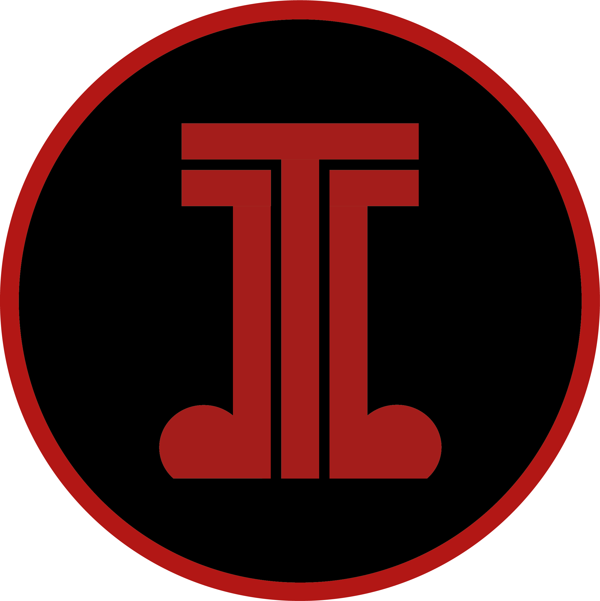
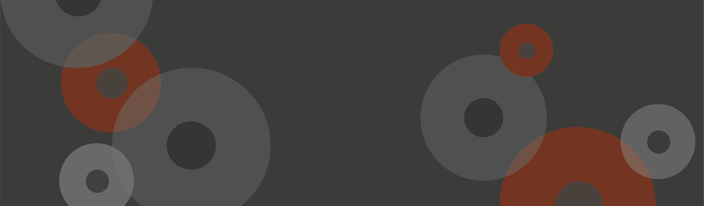

Welcome to Typetune!

I'm Laura, a Media, Journalism & Publishing student, living in Oxford. As part of my Typographic Design module I've created 'Typetune', a blog exploring the use of typography in the music industry. 

Music has accompanied me throughout my life, even now I'm listening to it as I type. As a child I would sit with my Dad, flipping through dusty boxes containing his record collection. The assortment of colours, fonts and imagery which adorned the album covers seemed to bring the music to life, each defining the sound of the record. 

Each era brings with it new imagery and text, seemingly telling a story and forming an image which not only fits the sound but becomes imprinted on society.  

What makes Typetune different?

* Looks back to the past, focusing on fonts in music from a variety of decades 
* Observes all genres of music and the artists at the time, particularly those off the beaten track
* Shows how music art inspired culture at the time

What are the brand's qualities? 

* Creativity: Typetune is inspired by album cover art, telling the stories behind the designs  
* Passion:  every article is written with a deep rooted interest in music 
* Accessibility: our articles are written in an accessible tone

## The Logo

The 'typetune' logo consists of a 'T' cocooned by two music notes. This gives the impression of an outline, emphasising the letter - making it easy to read from a distance. 

I have incorporated a dark colour scheme which encompasses the rich and edgy feel I want the blog to have. The red and black tones link to many of the genres of music discussed in the blog, such as punk and alternative music. The colour palette links to the branding behind many bands which aim to spread messages of rebellion, uprising and strength. 

I formed the sans serif 'T' by using shapes in adobe illustrator. Using a clean and modern font, the logo remains legible whilst maintaining structure and strength with its high weight. The 'T' has a low contrast to maintain legibility.

To keep the logo cohesive, I have surrounded the main body with a red circle, linking to the circular imagery seen in the music notes. 

The logo is also used as the Favicon to demonstrate that the brand is cohesive and because it remains legible on a smaller scale. 

## The Banner

To maintain a uniformed blog, the banner adopts the same colour scheme as the logo. Shades of grey and black occupy the image, broken with hints of red. The red pops as a point of interest, engaging the viewer whilst reflecting strength and rebellion, themes I want to be integrated throughout the blog.   

The shapes used take inspiration from CDs and vinyl, key symbols in the music industry. Their shape is echoed in the logo, demonstrating cohesion on the website. I also selected these shapes to avoid the space feeling cluttered and disorganised.